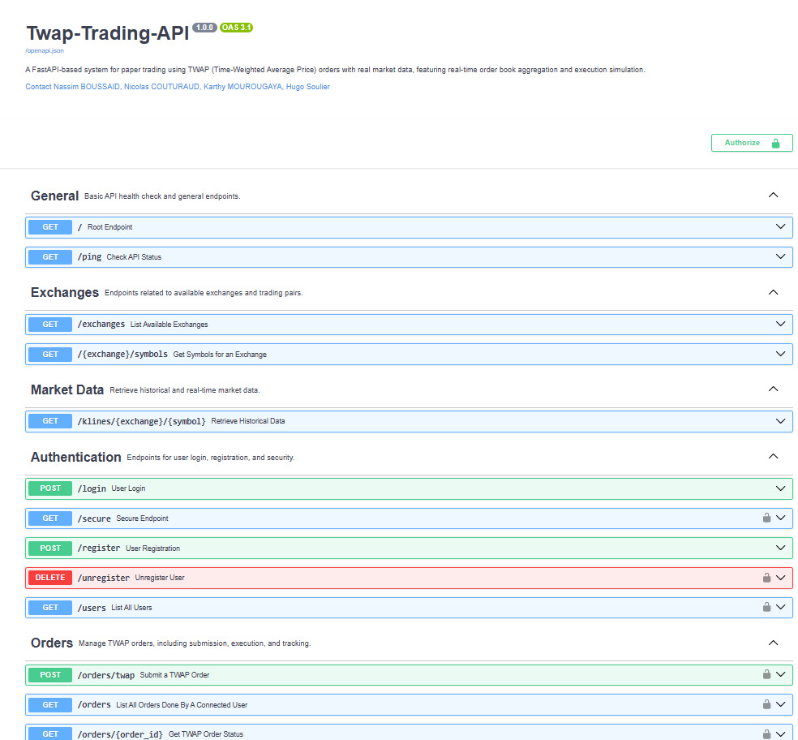

# Twap-Trading-API

## Overview

This repository contains a complete system designed for paper trading using TWAP (Time-Weighted Average Price) orders executed against real market data from cryptocurrency exchanges. It collects and standardizes real-time order book data from multiple exchanges and simulates order execution based on this data.

---

## Key Features

- **Market Data Collection**:
  - Connects to multiple cryptocurrency exchanges (e.g., Binance, Coinbase) via WebSocket feeds to gather order book data.
  - Standardizes data into a common format, independent of the exchange source.

- **Public Data Access**:
  - Retrieve historical market data:
    - Candlestick (kline) data for any supported exchange.
    - List of available exchanges.
    - Available trading pairs for each exchange.

- **Paper Trading System**:
  - Authenticated users can submit TWAP orders, which are executed against real-time order book data.
  - Simulates execution by dividing the total order quantity into time slices and checking the order book at each slice.
  - Tracks and reports order execution progress.

- **WebSocket Feed**:
  - WebSocket connections allow for real-time order book updates, broadcasting aggregated data every second for subscribed symbols.

- **API Authentication**:
  - JWT-based authentication for secure access to certain endpoints.

---

## Structure

```plaintext
Twap-Trading-API/
├── .github/                        # GitHub-related files (e.g., workflows, actions)
├── tests/                           # Unit tests and testing files
│   ├── __init__.py                  # Initialization file for tests
│   └── test_server.py               # Tests for server components
├── twap_trading_api/                # Core implementation of the API
│   ├── Client/                      # Client-side code to interact with the API
│   │   ├── __init__.py              # Client module initialization
│   │   └── Client.py                # Main client implementation
│   ├── Server_                      # Server-side code
│   │   ├── __init__.py              # Server module initialization
│   │   ├── Authentication/         # Authentication system
│   │   │   ├── __init__.py          # Initialization for authentication
│   │   │   └── AuthenticationManager.py  # Manages user authentication
│   │   ├── Exchanges/               # Exchange integration logic
│   │   │   ├── __init__.py          # Initialization for exchange modules
│   │   │   ├── ExchangeBase.py      # Base exchange class (for common functionality)
│   │   │   ├── ExchangeBinance.py   # Binance exchange integration
│   │   │   ├── ExchangeBybit.py     # Bybit exchange integration
│   │   │   ├── ExchangeCoinbase.py  # Coinbase exchange integration
│   │   │   ├── ExchangeKucoin.py    # Kucoin exchange integration
│   │   │   └── ExchangeMulti.py     # Aggregator for multiple exchanges
│   │   ├── Database/                # Database and persistence logic
│   │   │   ├── __init__.py          # Initialization for database-related files
│   │   │   ├── Database.py          # Database logic for orders and user management
│   │   │   └── api_database.db      # SQLite or other database storage
│   │   ├── app.py                   # FastAPI app entry point
│   │   ├── login.py                 # Login and authentication logic
│   │   ├── Server.py                # Main server code for API routing
│   │   ├── symbol.py                # Symbol and trading pair logic
│   │   ├── klines.py                # Exchange and Klines logic
├── pyproject.toml                   # Project configuration and dependencies
└── README.md                        # Project documentation (this file)

```

---

## Installation

To install the API, clone the repository:

```bash
git clone https://github.com/yourusername/Twap-Trading-API.git
cd Twap-Trading-API
```

Dependencies are handled with poetry:

```bash
pip install poetry
poetry install
poetry check
poetry shell
```

---

## Usage

### Running the Server

To start the server locally, run the following command:

```bash
uvicorn twap_trading_api.Server_.app:app --reload
```

The server will be available at `http://localhost:8000`.

### Running Tests

To run unit tests for the TWAP Trading API, ensure you have `poetry` installed and execute:

```bash
poetry run pytest
```

### Running the Demo

A demonstration script (`APIClientDemo`) is included to showcase the capabilities of the TWAP Trading API. The script covers authentication, market data retrieval, WebSocket order book streaming, and order placement.

To execute the demo script, ensure that the server is running and execute:

```bash
python twap_trading_api/Client/Twap_Trading_API_Demo.py
```

---

## API Endpoints

## General Endpoints

| Method | Endpoint | Description |
|--------|---------|-------------|
| `GET`  | `/`     | Root welcome message |
| `GET`  | `/ping` | API health check |

---

## Exchange Endpoints

| Method | Endpoint | Description |
|--------|---------|-------------|
| `GET`  | `/exchanges` | List all supported exchanges |
| `GET`  | `/{exchange}/symbols` | Get trading pairs for a specific exchange |

---

## Market Data Endpoints

| Method | Endpoint | Description | Parameters |
|--------|---------|-------------|------------|
| `GET`  | `/klines/{exchange}/{symbol}` | Fetch historical candlestick (klines) data | `exchange` (string) - Name of the exchange <br> `symbol` (string) - Trading pair symbol <br> `interval` (string) - Time interval <br> `start_time` (string) - Start date (ISO format) <br> `end_time` (string) - End date (ISO format) |

---

## WebSocket (Real-time Order Book)

| Method | Endpoint | Description |
|--------|---------|-------------|
| `WS`   | `/ws`   | Subscribe to real-time order book updates |

### WebSocket Actions

- **Subscribe**:  
  ```json
  { "action": "subscribe", "symbol": "BTCUSDT", "exchanges": ["Binance", "Bybit"] }

- **Unsubscribe**:  
  ```json
  { "action": "unsubscribe", "symbol": "BTCUSDT", "exchanges": ["Binance", "Bybit"] }

## Authentication Endpoints

| Method  | Endpoint        | Description                              | Parameters |
|---------|----------------|------------------------------------------|------------|
| `POST`  | `/login`       | User login (returns JWT token)          | `username` (string), `password` (string) |
| `POST`  | `/register`    | Register a new user                     | `username` (string), `password` (string) |
| `GET`   | `/secure`      | Protected endpoint (requires JWT)       | Requires JWT token in Authorization header |
| `DELETE`| `/unregister`  | Delete authenticated user (except admin) | Requires JWT token in Authorization header |
| `GET`   | `/users`       | List all users (admin only)             | Requires JWT token in Authorization header |

---

## Orders Endpoints

| Method  | Endpoint             | Description                           | Parameters |
|---------|----------------------|---------------------------------------|------------|
| `POST`  | `/orders/twap`       | Submit a new TWAP order              | `symbol` (string) - Trading pair <br> `side` (string) - "buy" or "sell" <br> `total_quantity` (float) - Total amount to execute <br> `limit_price` (float) - Max buy / Min sell price <br> `duration_seconds` (int) - Execution duration <br> `exchanges` (list) - Selected exchanges |
| `GET`   | `/orders`            | List all orders or a specific order  | `order_id` (optional) - Filter by order ID |
| `GET`   | `/orders/{order_id}` | Get execution details of a specific order | `order_id` (string) - Unique order ID |

---

## Streamlit

TBD

---

## API Documentation

Once the server is running, API documentation is available at: `http://localhost:8000/docs`.



---

## Authors

- Nassim BOUSSAID
- Nicolas COUTURAUD
- Karthy MOUROUGAYA
- Hugo SOULIER

Supervised by M. Rémi Genet

---

## License

This project is licensed under the MIT License.
